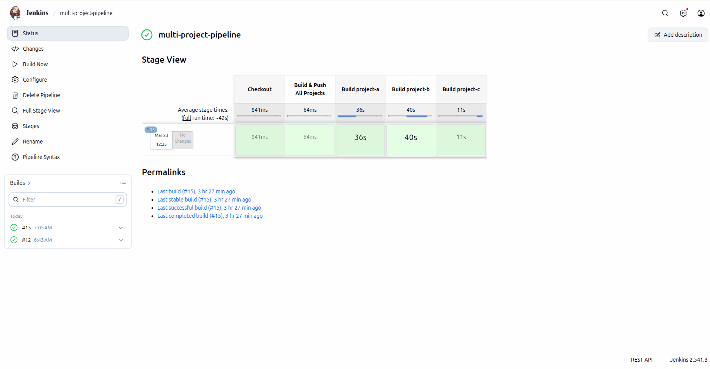
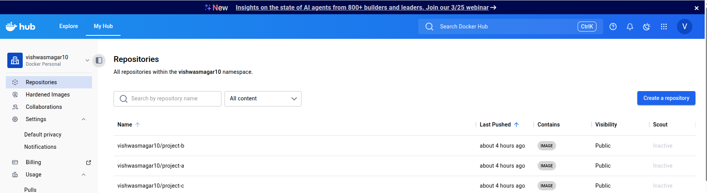

# Multi-Project Dockerized CI/CD Pipeline 🚀

## 📌 Overview

This project demonstrates a scalable and dynamic CI/CD pipeline using Jenkins that can handle multiple projects and technologies within a single repository.

The pipeline automatically detects project types, builds them, containerizes them using Docker, and deploys them — all in parallel.

---

## 🧰 Tech Stack

* Jenkins (CI/CD Orchestration)
* Docker (Containerization)
* GitHub (Source Code)
* Java (Maven)
* Node.js
* Python (Flask)

---

## 🏗️ Architecture Overview

* Single Jenkins pipeline for multiple projects
* Dynamic project detection
* Parallel execution of builds
* Docker-based build isolation
* Automated deployment

---

## 📂 Repository Structure

```
multi/
├── project-a   # Java (Maven)
├── project-b   # Java
├── project-c   # Node.js / Python
```

---

## 🔄 CI/CD Pipeline Workflow

1. Code Checkout from GitHub
2. Detect project type (Java / Node / Python)
3. Build all projects in parallel
4. Create Docker images for each project
5. Push images to Docker Hub
6. Deploy containers with port mapping

---

## ⚙️ Key Pipeline Features

### 🔍 Automatic Technology Detection

The pipeline detects project type based on files:

| File             | Technology |
| ---------------- | ---------- |
| pom.xml          | Java       |
| package.json     | Node.js    |
| requirements.txt | Python     |

---

### ⚡ Parallel Build Execution

* All projects are built simultaneously
* Reduces total pipeline execution time

---

### 🐳 Docker-Based Build Isolation

* Each project builds inside Docker
* Avoids dependency conflicts
* Supports multiple runtime versions

---

### 🔄 Automatic Java Version Detection

* Reads Dockerfile to detect Java version
* Uses appropriate Maven image:

  * Java 17 → maven:3.9.9-eclipse-temurin-17
  * Java 21 → maven:3.9.9-eclipse-temurin-21

---

### 📦 Docker Image Creation

Each project is built as a separate image:

```
vishwasmagar10/project-a:BUILD_NUMBER
vishwasmagar10/project-b:BUILD_NUMBER
vishwasmagar10/project-c:BUILD_NUMBER
```

---

### 🔐 Secure Docker Hub Integration

* Uses Jenkins Credentials Manager
* Prevents exposing secrets in pipeline

---

### 🚀 Deployment Strategy

| Project   | Host Port | Container Port |
| --------- | --------- | -------------- |
| project-a | 8081      | 8080           |
| project-b | 8082      | 3000           |
| project-c | 8083      | 5000           |

* Old containers are removed before deployment
* New containers are automatically started

---

## 🧪 Jenkins Pipeline Highlights

* Dynamic project iteration
* Reusable pipeline functions
* Parallel execution using Jenkins `parallel`
* Docker-in-Docker build strategy

---

## 📸 Screenshots
### 🔹 Jenkins  Stages



### 🔹 Docker Image Creation


---

## 🔥 Key Highlights

* Single pipeline for multiple projects
* Supports multiple technologies (Java, Node, Python)
* Parallel execution for faster builds
* Automatic runtime detection
* Docker-based consistent environments
* Production-level CI/CD design

---

## 💡 Real-World Use Case

This pipeline is suitable for:

* Microservices architecture
* Multi-team development environments
* Organizations using different tech stacks
* Scalable CI/CD systems

---

## 👨‍💻 Author

Vishwas Magar

---
